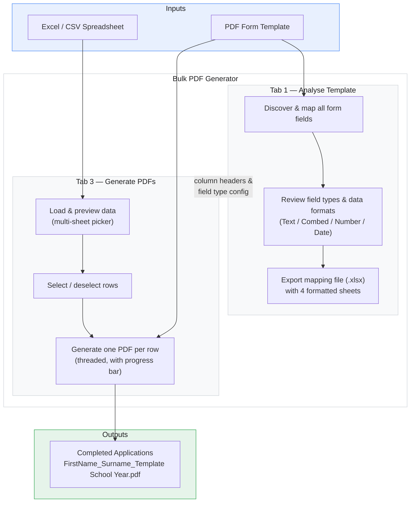
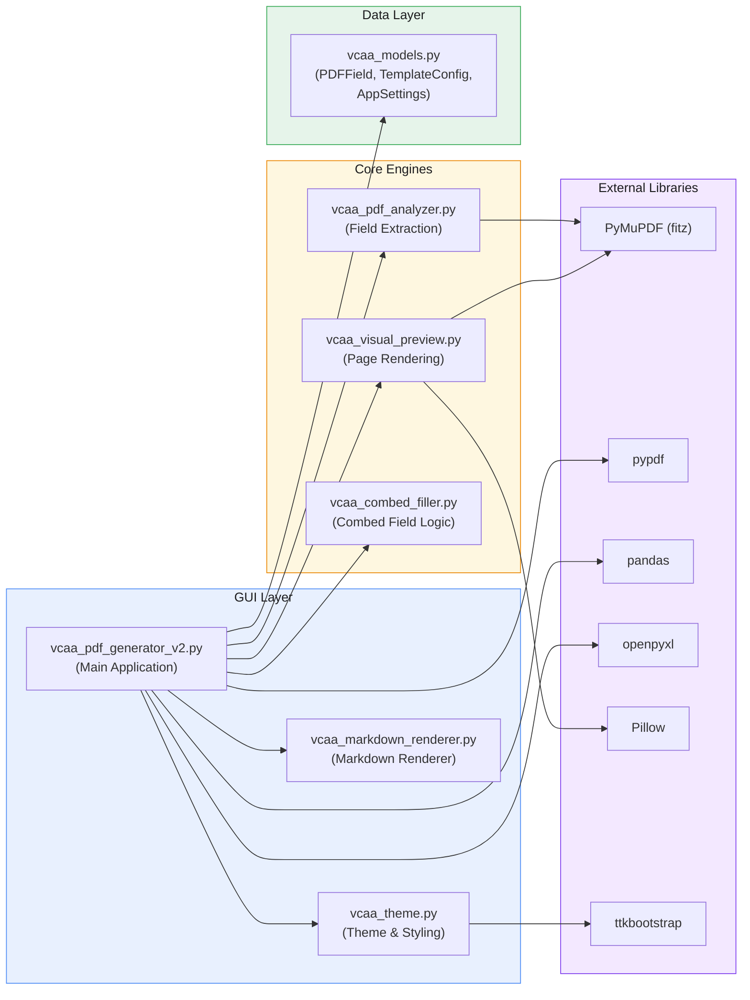

# Bulk PDF Generator

<div align="center">

**Batch-fill PDF forms from spreadsheet data — turning hours of manual data entry into a single click.**

[](https://gitlab.com/davearmswork/bulk-pdf-extractor-and-generator/-/releases/v2.5)

[](https://gitlab.com/davearmswork/bulk-pdf-extractor-and-generator/-/releases)
[](LICENSE)
[](https://python.org)

</div>

---

Originally built to streamline VCAA Special Examination Arrangements Evidence Application forms, but works with **any** PDF form — TAFE enrolments, leave applications, compliance forms, consent forms, and more.

> [!NOTE]
> A Principal-developed app for educators and school leaders. Always review all generated outputs before use.

> [!IMPORTANT]
> **This app runs entirely offline.** It does not connect to the internet, use cloud services, or include any AI tools. Your data never leaves your computer — all processing happens locally on your machine. No accounts, no logins, no telemetry.

---

<div align="center">
  
</div>

---

## Features

| | |
|:---:|---|
| **Batch processing** | Generate hundreds of filled PDFs from a single spreadsheet |
| **Auto field detection** | Scans any PDF and maps every form field automatically |
| **Combed field support** | Detects both multi-field and single-field combed formats automatically — including PDF comb flags with MaxLen |
| **Visual field preview** | Click any field to see it highlighted on the PDF page with zoomable preview (50%–400%) |
| **Field type audit** | Set field type (Text or Text-Combed with character length) and data format (Text, Number, Date) — Excel serial numbers convert to DD/MM/YYYY automatically |
| **Multi-sheet Excel** | Prompts you to pick the right sheet when a workbook has multiple tabs |
| **Export mapping file** | One-click Excel export with Field Mapping, Data Entry, Instructions, and About sheets — all data columns formatted as text to preserve numbers |
| **Template library** | Save, reload, and manage template configurations across sessions |
| **School settings** | Configures school name and year for output filenames once, remembered forever |
| **One-click output** | All PDFs saved to a named folder; output opens automatically |
| **Cross-platform** | Runs on Windows 10/11, macOS, and Linux; pre-built `.exe` for Windows and `.dmg` for macOS |
| **No tech skills needed** | Single-file download — `.exe` for Windows, `.dmg` for Mac — no Python or IT support required |

---

## How It Works



### The three-step workflow

1. **Analyse** your blank PDF to discover every form field and set data types
2. **Fill in** a spreadsheet — one row per person, column headers matching field names
3. **Generate** — the app fills and saves a complete, separate PDF for every row

---

## Quick Start

### Step 1 — Download

> [!IMPORTANT]
> **Pre-built binaries available for Windows 10/11 and macOS 12+.** Linux users can [run from source](#-for-developers--running-from-source).

**No Python, no installation, no IT support required** — just download and double-click.

<div align="center">

| Windows | macOS |
|:---:|:---:|
| [](https://gitlab.com/davearmswork/bulk-pdf-extractor-and-generator/-/releases/v2.5) | [](https://gitlab.com/davearmswork/bulk-pdf-extractor-and-generator/-/releases/v2.5/downloads/binaries/Bulk.PDF.Generator.Mac.dmg) |
| `Bulk PDF Generator.exe` | `Bulk.PDF.Generator.Mac.dmg` |
| Windows 10 / 11 | macOS 12 Monterey or later |

</div>

Save the file somewhere convenient — your Desktop, a shared school drive, or a dedicated apps folder.

---

### Step 2 — Run the app

**Windows:** Double-click **`Bulk PDF Generator.exe`**.

**Mac:** Open **`Bulk.PDF.Generator.Mac.dmg`**, then drag **Bulk PDF Generator** into your Applications folder. Double-click to open from there.

<details>
<summary><strong>Windows Security Warning — what to do if you see it</strong></summary>

<br>

Because this app is not commercially code-signed (certificates cost hundreds of dollars per year), Windows Defender SmartScreen will flag it on first run. **The app is safe.** This is a known false positive for self-distributed software — the full source code is open for inspection.

**What you'll see:**

> *"Windows protected your PC"*
> *"Microsoft Defender SmartScreen prevented an unrecognised app from starting."*

**What to do:**

1. Click **"More info"** (the small link below the warning message)
2. A **"Run anyway"** button will appear at the bottom
3. Click **"Run anyway"**

You only need to do this **once**. Windows remembers your choice and the app opens normally from then on.

> [!TIP]
> **School IT environments:** If your managed security policy shows no "Run anyway" option, ask your IT administrator to whitelist the app or add an exclusion. The complete source code is at [gitlab.com/davearmswork/bulk-pdf-extractor-and-generator](https://gitlab.com/davearmswork/bulk-pdf-extractor-and-generator) for their review.

</details>

<details>
<summary><strong>Mac Security Warning — what to do if you see it</strong></summary>

<br>

Because this app is not signed with an Apple Developer certificate (certificates cost hundreds of dollars per year), macOS Gatekeeper will block it on first run. **The app is safe.** This is a known restriction for self-distributed software — the full source code is open for inspection.

**What you'll see:**

> *"Bulk PDF Generator cannot be opened because it is from an unidentified developer."*

**What to do:**

1. Open **System Settings** → **Privacy & Security**
2. Scroll down — you'll see a message about Bulk PDF Generator being blocked
3. Click **"Open Anyway"**

Alternatively, right-click the app in your Applications folder and choose **"Open"** — then click **"Open"** in the dialog that appears.

You only need to do this **once**. macOS remembers your choice and the app opens normally from then on.

</details>

---

## Try It With Sample Data

Not sure where to start? Download the sample files to see exactly how the app works before touching any real data — no setup required.

<div align="center">

### [Download All Sample Files — ZIP, 2 MB](samples/Sample%20Files.zip)

</div>

### What's included

| File | Download | Description |
|------|:--------:|-------------|
| `Evidence Application sample PDF from VCAA.pdf` | [Link](samples/Evidence%20Application%20sample%20PDF%20from%20VCAA.pdf) | **The blank PDF template** — this is the form the app fills in |
| `Evidence Application spreadsheet with data.xlsx` | [Link](samples/Evidence%20Application%20spreadsheet%20with%20data.xlsx) | **Full data spreadsheet** — 3 fictional students; multi-sheet workbook that demonstrates the sheet-picker dialog |
| `sample data.xlsx` | [Link](samples/sample%20data.xlsx) | **Simple single-sheet version** — loads instantly, no sheet-picker dialog |
| `Duis_Ex_Evidence Application ... 2026.pdf` | [Link](samples/Duis_Ex_Evidence%20Application%20Wangaratta%20High%20School%202026.pdf) | **Sample output** — completed form for student 1 |
| `Minim_Elit_Evidence Application ... 2026.pdf` | [Link](samples/Minim_Elit_Evidence%20Application%20Wangaratta%20High%20School%202026.pdf) | **Sample output** — completed form for student 2 |
| `Sunt_Culpa_Evidence Application ... 2026.pdf` | [Link](samples/Sunt_Culpa_Evidence%20Application%20Wangaratta%20High%20School%202026.pdf) | **Sample output** — completed form for student 3 |

### How to run the sample

1. Download the ZIP above and unzip it, or grab the files individually from the table
2. Open the app and go to **Generate PDFs** (Tab 3)
3. Under **PDF Template**, browse to **`Evidence Application sample PDF from VCAA.pdf`**
4. Under **Excel / CSV Data File**, browse to **`Evidence Application spreadsheet with data.xlsx`**
5. Click **Load & Preview Data** — a sheet-picker dialog appears (this is a multi-sheet workbook). Select **Data** and click **Load this sheet**
6. Three student rows appear — click **Generate PDFs**
7. Your three completed PDFs land in a **`Completed Applications`** folder. Compare them with the three sample output PDFs to confirm everything is working correctly

> [!TIP]
> Want to skip the sheet-picker? Load **`sample data.xlsx`** instead — it's a single-sheet file that loads immediately without the dialog.

Once you're comfortable, you're ready to use it with your own PDF template and real data.

---

## How to Use

The app has five tabs arranged as a guided workflow:

### Getting Started (Tab 0)

An in-app guide covering how to prepare PDF templates — naming form fields in Adobe Acrobat Pro, understanding combed fields, and setting up your spreadsheet. **Read this first** when working with a new template.

---

### Analyse Template (Tab 1)

1. Click **Browse** and select your blank PDF form
2. Click **Analyse Fields** — every form field is listed with its name, type, page, and length
3. **Review Field Types** — an audit dialog appears with four columns:
   - **Field Type** — toggle between Text and Text-Combed (with character length) for any text field
   - **Data Type** — set to Text, Number (strips trailing `.0`), or Date (converts Excel serial numbers)
   - Fields with "date", "dob", or "birth" in their name default to **Date (DD/MM/YYYY)**
   - Single-field comb fields (PDF comb flag + MaxLen) are auto-detected as Text-Combed
   - Your choices are saved with the template and restored next time
4. Click any field in the list to see it **highlighted in red** on the zoomable PDF preview
5. Double-click the **Data Type** column to change a field's type inline at any time
6. Click **Export Mapping File** to download a formatted Excel template with four sheets:

   | Sheet | Contents |
   |-------|----------|
   | **Field Mapping** | Every PDF field with suggested column name, type, page, required status, and notes |
   | **Data Entry** | Ready-to-use template with column headers, 50 empty rows, frozen header, auto-width columns |
   | **Instructions** | Step-by-step guide for filling in the data |
   | **About** | App version, developer info, disclaimer |

7. Click **Save Template Config** to remember this template's setup for next time

---

### Generate PDFs (Tab 3)

1. Select your PDF template and your filled-in Excel or CSV data file
2. Click **Load & Preview Data**

   > **Multi-sheet Excel files:** If your workbook has more than one sheet, a dialog will appear asking which sheet contains your data. This commonly occurs with files exported by the Analyse Template tab (which include a *Data*, *Field Mapping*, and *Instructions* sheet). Select your data sheet and click **Load this sheet**. If you cancel, nothing is loaded — just click **Load & Preview Data** again to retry.

3. You'll see a row for each person in your data — all rows are selected by default
4. Deselect any rows you want to skip
5. Click **Generate PDFs** — a progress bar tracks each file as it's created
6. When finished, your output folder opens automatically

---

### About (Tab 4)

Version information, developer contact, and build details.

---

## What Are Combed Fields?

Government PDF forms often use individual character boxes for identifiers like student numbers:

```
+-+-+-+-+-+-+-+-+-+-+
|V|C|A|A|1|2|3|4|5|6|
+-+-+-+-+-+-+-+-+-+-+
```

The app **automatically detects** these and fills your data correctly — just put the full value in your spreadsheet.

### Two types of combed field

| Type | How it works | Detection |
|------|-------------|-----------|
| **Multi-field combed** | Each character box is a separate PDF field (`Surname[0]`, `Surname[1]`, ...) | Auto-detected by field name pattern — the app splits your text character-by-character |
| **Single-field combed** | One PDF field with a comb flag and MaxLen property | Auto-detected by reading the PDF field dictionary — the app writes the value directly and the PDF renderer handles the character boxes |

### Multi-field naming patterns

The detection engine recognises three common naming patterns for multi-field combed fields:

| Pattern | Example fields |
|---------|---------------|
| Bracketed | `StudentNumber[0]`, `StudentNumber[1]`, `StudentNumber[2]` ... |
| Underscore | `StudentNumber_0`, `StudentNumber_1`, `StudentNumber_2` ... |
| Sequential | `StudentNumber0`, `StudentNumber1`, `StudentNumber2` ... |

All three are grouped automatically under a single logical field (e.g. `StudentNumber`) in the analysis view.

### Manual override

If the analyser misses a combed field, you can manually change any text field to **Text-Combed** in the field type audit dialog and specify the character length. This override is saved with the template configuration.

---

## Spreadsheet Setup

Column headers must **match your PDF field names** (case-insensitive — `Surname`, `SURNAME`, and `surname` all work).

Two columns are required to name the output files:

- A column for the person's **surname**
- A column for their **first name**

All other columns are matched to PDF fields automatically. Unmatched columns are silently ignored.

**Supported formats:** `.xlsx` | `.xls` | `.csv`

### Multi-sheet Excel files

If your workbook contains more than one sheet, the app prompts you to choose which sheet holds your data before loading. This is especially common when using a file exported by the Analyse Template tab (which includes three sheets: *Data*, *Field Mapping*, and *Instructions*).

> [!TIP]
> To skip the prompt entirely, save your data as a single-sheet `.xlsx` or `.csv`. Single-sheet files always load immediately with no confirmation step.

### Field data types

When you analyse a PDF template, the app lets you set each field's data type:

| Data type | What it does | Example |
|-----------|-------------|---------|
| **Text** | Passes the value through as-is | `John Smith` |
| **Number** | Strips trailing `.0` from whole numbers | `12345.0` becomes `12345` |
| **Date (DD/MM/YYYY)** | Converts Excel serial numbers to Australian date format | `45313` becomes `22/01/2024` |

Date fields also handle values that are already `datetime` objects — they're formatted to DD/MM/YYYY regardless of how Excel stored them.

---

## Output Files

Generated PDFs are saved to a **`Completed Applications`** folder next to your data file (or a custom folder you specify). Files are named:

```
FirstName_Surname_TemplateName SchoolName Year.pdf
```

If a file with the same name already exists, the app adds `(1)`, `(2)`, etc. rather than overwriting.

---

## Architecture



### Module overview

| Module | Lines | Responsibility |
|--------|------:|----------------|
| `vcaa_pdf_generator_v2.py` | ~2,700 | Main application — tabbed GUI, dialogs, Excel I/O, PDF generation pipeline, template management |
| `vcaa_models.py` | ~190 | Data models (`PDFField`, `TemplateConfig`, `AppSettings`) with JSON serialization and atomic file writes |
| `vcaa_pdf_analyzer.py` | ~200 | PDF field extraction using PyMuPDF — detects combed fields via regex pattern matching on field names |
| `vcaa_visual_preview.py` | ~200 | PDF page rendering with red-rectangle field highlighting; dual-tier cache (memory LRU + disk PNG) |
| `vcaa_combed_filler.py` | ~200 | Pure-logic module for splitting text into character-by-character fields with configurable alignment and padding |
| `vcaa_theme.py` | ~250 | Centralised theme system built on ttkbootstrap; platform-aware typography, semantic colour palette, spacing constants |
| `vcaa_markdown_renderer.py` | ~170 | Subset markdown parser rendering headings, bold, bullets, and clickable links into tkinter Text widgets |
| `_generate_version.py` | ~30 | Build-time script — extracts git commit hash and date, writes `_version.py` for the About tab |

### Key design decisions

- **Thread safety** — PDF generation runs on a background thread with a deep-copied snapshot of all shared state; UI updates via `root.after()` callbacks
- **Atomic file writes** — Template configs and settings use `tempfile` + `os.replace()` to prevent corruption on crash
- **Dual-tier caching** — Preview renders are cached in memory (LRU) and on disk (PNG) for instant page switching
- **Platform-aware scrolling** — Mousewheel events branch by platform (Windows `delta/120`, macOS `delta`, Linux `Button-4`/`Button-5`)
- **Backward-compatible persistence** — `from_json()` methods filter unknown keys so newer config files load in older versions and vice versa

See [ARCHITECTURE.md](ARCHITECTURE.md) for a full technical breakdown of data flow, threading model, caching strategy, and error handling.

---

## Troubleshooting

| Problem | Solution |
|---------|----------|
| Windows shows "Windows protected your PC" | Click **More info** then **Run anyway** — see the [warning guide](#step-2--run-the-app) above |
| IT security blocks the app with no "Run anyway" option | Ask your IT admin to whitelist it; share the [open-source repo](https://gitlab.com/davearmswork/bulk-pdf-extractor-and-generator) for their review |
| A "Select Sheet" dialog appeared | Expected — your file has multiple sheets. Select the one with your data and click **Load this sheet** |
| Accidentally closed the sheet-picker dialog | Click **Load & Preview Data** again to re-open it |
| Fields not filling in output PDFs | Check that Excel column headers exactly match PDF field names (case-insensitive) |
| Date shows as a number like `45313` | Set the field to **Date (DD/MM/YYYY)** in the field type audit dialog during analysis |
| Visual preview not showing | Click **Analyse Fields** first in Tab 1 |
| Combed fields not splitting into separate boxes | Run **Analyse Fields** in Tab 1 before generating in Tab 3 |
| Combed field not detected automatically | Change the field to **Text-Combed** in the audit dialog and enter the character length |
| Text truncated or misaligned in combed boxes | Ensure the field is detected as Text-Combed — the app uses the correct rendering mode for each type |
| "Permission denied" error when loading Excel | Close the file in Excel before running the app |
| Numbers showing as `12345.0` | Re-export the mapping file — v2.5 formats all data columns as text. Or set the field to **Number** in the audit dialog |

---

## For Developers — Running from Source

<details>
<summary><strong>Expand setup and build instructions</strong></summary>

### Requirements

- Python 3.10+
- `pip install -r requirements.txt`
- tkinter (included with standard Python on Windows; on macOS: `brew install python-tk@3.xx`)

### Setup

```bash
git clone https://gitlab.com/davearmswork/bulk-pdf-extractor-and-generator.git
cd bulk-pdf-extractor-and-generator
python -m venv venv

# Windows
.\venv\Scripts\activate

# macOS / Linux
source venv/bin/activate

pip install -r requirements.txt
python vcaa_pdf_generator_v2.py
```

### Dependencies

| Package | Version | Purpose |
|---------|---------|---------|
| [pypdf](https://pypi.org/project/pypdf/) | >= 4.0.0 | PDF form filling and writing |
| [pandas](https://pypi.org/project/pandas/) | >= 2.0.0 | Excel / CSV data loading and processing |
| [openpyxl](https://pypi.org/project/openpyxl/) | >= 3.0.0 | Excel file creation with formatting |
| [PyMuPDF](https://pypi.org/project/PyMuPDF/) | >= 1.23.0 | PDF analysis, field extraction, page rendering |
| [Pillow](https://pypi.org/project/Pillow/) | >= 10.0.0 | Image processing for visual preview |
| [ttkbootstrap](https://pypi.org/project/ttkbootstrap/) | >= 1.10.1 | Modern themed GUI framework on top of tkinter |

### Building the Windows Executable

```bash
pip install pyinstaller
python _generate_version.py          # Bake git commit + date into _version.py
python -m PyInstaller BulkPDFGenerator.spec --clean
# Output: dist/Bulk PDF Generator.exe
```

Or double-click **`build_windows.bat`** for a guided, one-step build.

The spec file bundles PyMuPDF binaries, ttkbootstrap theme assets, openpyxl templates, pandas data files, and all app resources into a single ~80–120 MB `.exe`. UPX compression is disabled to reduce antivirus false positives.

### Project Structure

```
bulk-pdf-extractor-and-generator/
|
|-- vcaa_pdf_generator_v2.py          # Main application (GUI, dialogs, generation pipeline)
|-- vcaa_models.py                    # Data models (PDFField, TemplateConfig, AppSettings)
|-- vcaa_pdf_analyzer.py              # PDF field extraction engine (PyMuPDF)
|-- vcaa_visual_preview.py            # PDF page rendering + field highlighting
|-- vcaa_combed_filler.py             # Character-by-character field filling logic
|-- vcaa_theme.py                     # Theme system (colours, fonts, spacing)
|-- vcaa_markdown_renderer.py         # Markdown renderer for Getting Started tab
|
|-- getting_started.md                # In-app guide content (rendered in Tab 0)
|-- icon.png / icon.ico               # Application icons
|-- app_visualisation.png             # Visual diagram for documentation
|
|-- _generate_version.py              # Build-time version baking script
|-- _version.py                       # Auto-generated (commit hash + build date)
|-- requirements.txt                  # Python dependencies
|-- BulkPDFGenerator.spec             # PyInstaller build configuration
|-- build_windows.bat                 # Windows build script (one-step)
|-- Launch_BulkPDFGenerator.bat       # Windows launcher (from source)
|-- Launch_BulkPDFGenerator.command   # macOS launcher (from source)
|
|-- ARCHITECTURE.md                   # Technical architecture documentation
|-- SECURITY.md                       # Security policy
|-- LICENSE                           # MIT licence
|-- README.md                         # This file
```

</details>

---

## Developer

**Dave Armstrong** — Principal, Wangaratta High School

A Principal-developed app for educators and school leaders.

| | |
|---|---|
| Email | [Dave.Armstrong@education.vic.gov.au](mailto:Dave.Armstrong@education.vic.gov.au) |
| GitLab | [gitlab.com/davearmswork/bulk-pdf-extractor-and-generator](https://gitlab.com/davearmswork/bulk-pdf-extractor-and-generator) |

---

## Licence

MIT — see [LICENSE](LICENSE) for details.

This project uses [PyMuPDF](https://pymupdf.readthedocs.io/) which is licensed under AGPL-3.0. PyMuPDF's AGPL licence applies to that component. If you plan to redistribute a modified, closed-source version of this application, you should review PyMuPDF's [licensing terms](https://pymupdf.readthedocs.io/en/latest/about.html#license-and-copyright).
