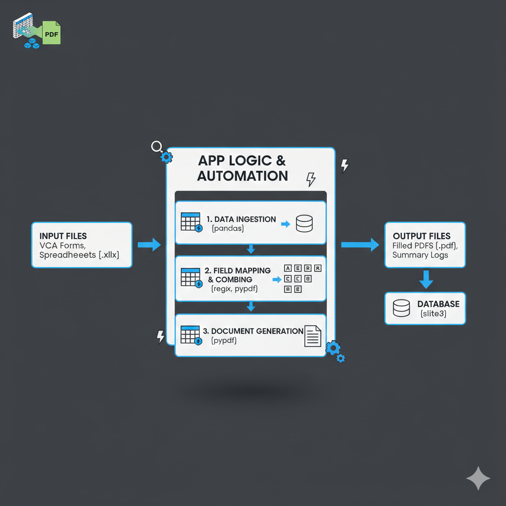
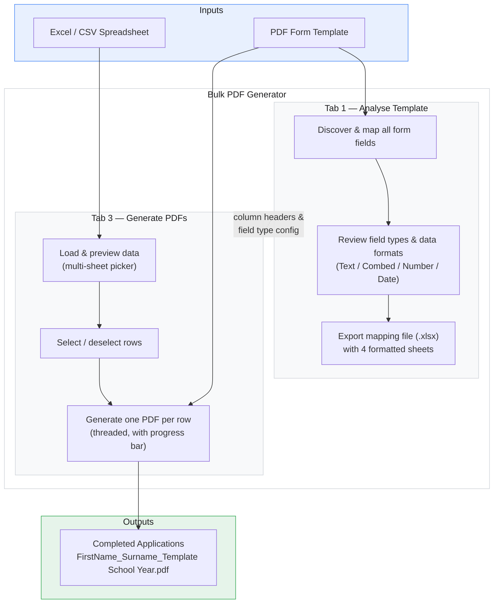
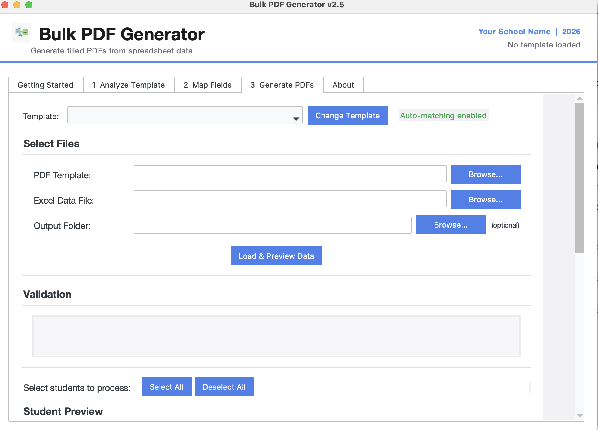
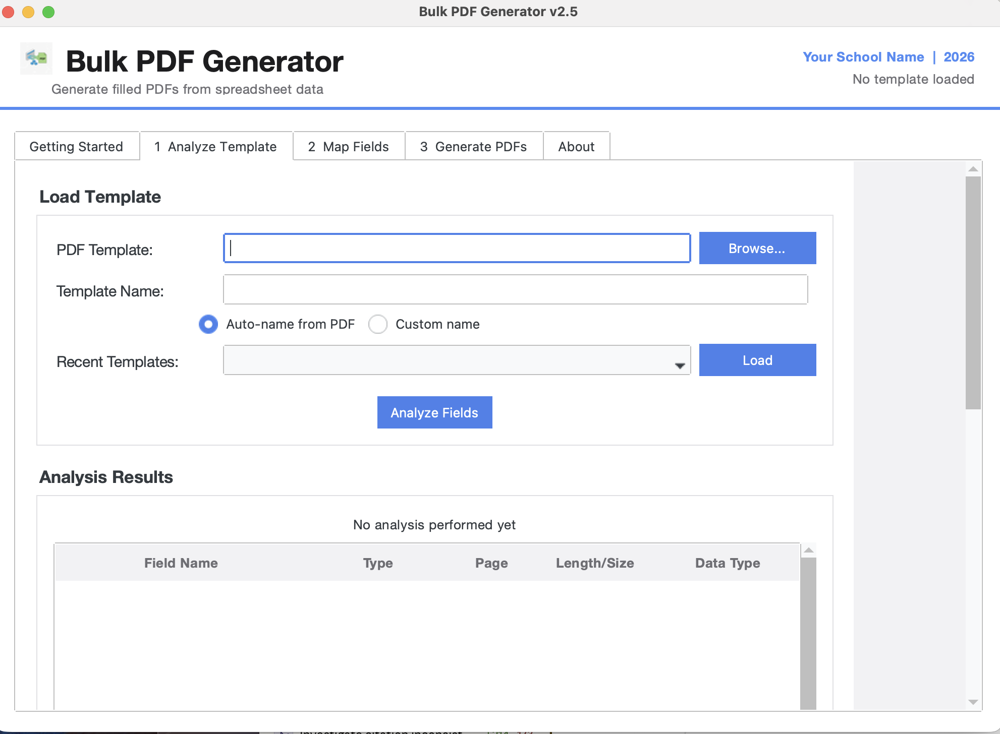
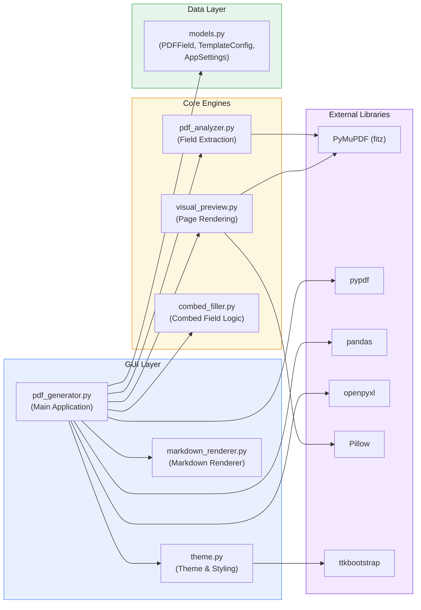

# Bulk PDF Generator

<div align="center">

**Batch-fill PDF forms from spreadsheet data — turning hours of manual data entry into a single click.**

[](https://github.com/mrdavearms/bulk-pdf-extractor-and-generator/releases/latest)

[](https://github.com/mrdavearms/bulk-pdf-extractor-and-generator/actions/workflows/release.yml)
[](https://github.com/mrdavearms/bulk-pdf-extractor-and-generator/releases)
[](LICENSE)
[](https://python.org)

</div>

---

Originally built to streamline VCAA Special Examination Arrangements Evidence Application forms, but works with **any** PDF form — TAFE enrolments, leave applications, compliance forms, consent forms, and more. The app examines the PDF for any fillable form fields, seeks confirmation and changes and then generates an Excel file
for you to fill in content. Then use that Excel data to fill in the form in bulk at high speed. Massive time saver if used well.

> [!NOTE]
> A Principal-developed app for educators and school leaders. Always review all generated outputs before use.

> [!IMPORTANT]
> **This app runs entirely offline.** It does not connect to the internet, use cloud services, or include any AI tools. Your data never leaves your computer — all processing happens locally on your machine. No accounts, no logins, no telemetry.

---

<div align="center">
  
</div>

---

## Table of Contents

- [Features](#features)
- [How It Works](#how-it-works)
- [Quick Start](#quick-start)
  - [Download](#step-1--download)
  - [Run the App](#step-2--run-the-app)
- [Try It With Sample Data](#try-it-with-sample-data)
- [How to Use](#how-to-use)
  - [Getting Started (Tab 0)](#getting-started-tab-0)
  - [Analyse Template (Tab 1)](#analyse-template-tab-1)
  - [Map Fields (Tab 2)](#map-fields-tab-2)
  - [Generate PDFs (Tab 3)](#generate-pdfs-tab-3)
  - [About (Tab 4)](#about-tab-4)
- [What Are Combed Fields?](#what-are-combed-fields)
- [Spreadsheet Setup](#spreadsheet-setup)
  - [Column Headers](#column-headers)
  - [Multi-sheet Excel Files](#multi-sheet-excel-files)
  - [Field Data Types](#field-data-types)
  - [Date Handling In Depth](#date-handling-in-depth)
- [Output Files](#output-files)
- [Privacy and Security](#privacy-and-security)
- [Architecture](#architecture)
- [Troubleshooting](#troubleshooting)
- [Frequently Asked Questions](#frequently-asked-questions)
- [For Developers — Running from Source](#for-developers--running-from-source)
- [Release Notes](#release-notes)
- [Developer](#developer)
- [Licence](#licence)

---

## Features

| | |
|:---:|---|
| **Batch processing** | Generate hundreds of filled PDFs from a single spreadsheet. Each row in your data produces one complete, separate PDF — no manual copy-paste, no repeated form filling. Whether you have 3 students or 300, the process is the same. |
| **Auto field detection** | Scans any PDF and maps every form field automatically. The analyser reads field names, types, pages, and positions from the PDF's internal structure using PyMuPDF. No manual configuration needed for standard text fields. |
| **Combed field support** | Detects both multi-field and single-field combed formats automatically — including PDF comb flags with MaxLen. Government forms often use individual character boxes for student numbers, dates, and identifiers. The app recognises these automatically and fills them correctly. See [What Are Combed Fields?](#what-are-combed-fields) for details. |
| **Visual field preview** | Click any field in the analysis list to see it highlighted in red on the actual PDF page. The preview supports zoom from 50% to 400%, and uses a dual-tier cache (memory + disk) so page switching is instant after the first render. |
| **Field type audit** | After analysis, a dedicated audit dialog lets you review and configure every field. Set the field type (Text or Text-Combed with character length) and the data format (Text, Number, Date). Fields containing "date", "dob", or "birth" in their name are automatically suggested as Date fields. Your choices are saved with the template and restored on reload. |
| **Field mapping editor** | Tab 2 shows every PDF field alongside a dropdown of your Excel columns. Set mappings manually, run Auto-Map All for smart guesses, or clear and start over. Explicit mappings take priority over auto-matching during generation, and are saved with the template. Tab 3 warns you if any fields won't match — with a direct prompt to fix them in Tab 2. |
| **Multi-sheet Excel** | When you load an Excel workbook with multiple sheets, a dialog prompts you to pick the correct one. This commonly occurs with mapping files exported by the app itself (which contain Data, Field Mapping, Instructions, and About sheets). Single-sheet files load instantly with no prompt. |
| **Export mapping file** | One-click Excel export with four formatted sheets: **Field Mapping** (every PDF field with type, page, and notes), **Data Entry** (ready-to-use template with column headers, 50 empty rows, frozen header row, auto-width columns, all data columns formatted as text), **Instructions** (step-by-step filling guide), and **About** (app version, developer info, disclaimer). |
| **Template library** | Save, reload, and manage template configurations across sessions. Once you've analysed a PDF and set your field types, save the template config. Next time you use the same form, load the saved template to skip the analysis step entirely. Templates are stored as small JSON files in a configurable directory. |
| **School settings** | Configure your school name and year once — they're saved to a settings file and remembered across sessions. These values are used to name output files (e.g. `Smith_John_Evidence Application Wangaratta High School 2026.pdf`). Change them any time from the settings menu. |
| **One-click output** | All generated PDFs are saved to a `Completed Applications` folder next to your data file (or a custom folder you specify). When generation finishes, the app asks if you want to open the folder — click Yes and your file manager opens right there. |
| **Cross-platform** | Runs on Windows 10/11, macOS 12 Monterey or later, and Linux. Pre-built binaries are available for Windows (`.exe`) and macOS (`.dmg`). Linux users run from source — see [For Developers](#for-developers--running-from-source). |
| **No tech skills needed** | Single-file download — `.exe` for Windows, `.dmg` for Mac — no Python, no installation, no IT support required. Download, double-click, and start generating PDFs. |

---

## How It Works



### The three-step workflow

1. **Analyse** your blank PDF to discover every form field, set field types, and configure data formats
2. **Fill in** a spreadsheet — one row per person, column headers matching field names
3. **Generate** — the app fills and saves a complete, separate PDF for every row

That's it. No coding, no merging, no manual form filling. The same workflow applies whether you're processing VCAA exam forms, TAFE enrolments, or any other PDF with form fields.

---

## Quick Start

### Step 1 — Download

> [!IMPORTANT]
> **Pre-built binaries available for Windows 10/11 and macOS 12+.** Linux users can [run from source](#for-developers--running-from-source).

**No Python, no installation, no IT support required** — just download and double-click.

Go to the **[Releases page](https://github.com/mrdavearms/bulk-pdf-extractor-and-generator/releases/latest)** and download the file for your platform:

| Platform | File | Requirements |
|:---:|:---:|:---:|
| Windows | `Bulk PDF Generator.exe` (~61 MB) | Windows 10 / 11 |
| macOS | `Bulk.PDF.Generator.macOS.zip` | macOS 12 Monterey or later |

Save the file somewhere convenient — your Desktop, a shared school drive, or a dedicated apps folder. The app is self-contained; it doesn't install anything or modify your system.

---

### Step 2 — Run the app

**Windows:** Double-click **`Bulk PDF Generator.exe`**. The first launch takes a few seconds as the app extracts its bundled files to a temporary directory. Subsequent launches are faster.

**Mac:** Unzip **`Bulk.PDF.Generator.macOS.zip`**, then drag **Bulk PDF Generator** into your Applications folder. Double-click to open from there.

<details>
<summary><strong>Windows Security Warning — what to do if you see it</strong></summary>

<br>

Because this app is not commercially code-signed (certificates cost hundreds of dollars per year), Windows Defender SmartScreen will flag it on first run. **The app is safe.** This is a known false positive for self-distributed software — the full source code is open for inspection.

**What you'll see:**

> *"Windows protected your PC"*
> *"Microsoft Defender SmartScreen prevented an unrecognised app from starting."*

**What to do:**

1. Click **"More info"** (the small link below the warning message)
2. A **"Run anyway"** button will appear at the bottom
3. Click **"Run anyway"**

You only need to do this **once**. Windows remembers your choice and the app opens normally from then on.

> [!TIP]
> **School IT environments:** If your managed security policy shows no "Run anyway" option, ask your IT administrator to whitelist the app or add an exclusion. The complete source code is at [github.com/mrdavearms/bulk-pdf-extractor-and-generator](https://github.com/mrdavearms/bulk-pdf-extractor-and-generator) for their review.

</details>

<details>
<summary><strong>Mac Security Warning — what to do if you see it</strong></summary>

<br>

Because this app is not signed with an Apple Developer certificate (certificates cost hundreds of dollars per year), macOS Gatekeeper will block it on first run. **The app is safe.** This is a known restriction for self-distributed software — the full source code is open for inspection.

**What you'll see:**

> *"Bulk PDF Generator cannot be opened because it is from an unidentified developer."*

**What to do:**

1. Open **System Settings** → **Privacy & Security**
2. Scroll down — you'll see a message about Bulk PDF Generator being blocked
3. Click **"Open Anyway"**

Alternatively, right-click the app in your Applications folder and choose **"Open"** — then click **"Open"** in the dialog that appears.

You only need to do this **once**. macOS remembers your choice and the app opens normally from then on.

</details>

<details>
<summary><strong>First-time setup — school name and year</strong></summary>

<br>

On first launch, the app will ask for your **school name** and **current year**. These are used to name the output PDF files:

```
FirstName_Surname_TemplateName SchoolName Year.pdf
```

For example: `John_Smith_Evidence Application Wangaratta High School 2026.pdf`

You can change these values at any time. They're saved to a local settings file and persist across sessions.

</details>

---

## Try It With Sample Data

Not sure where to start? Download the sample files to see exactly how the app works before touching any real data — no setup required.

<div align="center">

### [Download All Sample Files — ZIP, 2 MB](samples/Sample%20Files.zip)

</div>

### What's included

| File | Download | Description |
|------|:--------:|-------------|
| `Evidence Application sample PDF from VCAA.pdf` | [Link](samples/Evidence%20Application%20sample%20PDF%20from%20VCAA.pdf) | **The blank PDF template** — this is the form the app fills in |
| `Evidence Application spreadsheet with data.xlsx` | [Link](samples/Evidence%20Application%20spreadsheet%20with%20data.xlsx) | **Full data spreadsheet** — 3 fictional students; multi-sheet workbook that demonstrates the sheet-picker dialog |
| `sample data.xlsx` | [Link](samples/sample%20data.xlsx) | **Simple single-sheet version** — loads instantly, no sheet-picker dialog |
| `Duis_Ex_Evidence Application ... 2026.pdf` | [Link](samples/Duis_Ex_Evidence%20Application%20Wangaratta%20High%20School%202026.pdf) | **Sample output** — completed form for student 1 |
| `Minim_Elit_Evidence Application ... 2026.pdf` | [Link](samples/Minim_Elit_Evidence%20Application%20Wangaratta%20High%20School%202026.pdf) | **Sample output** — completed form for student 2 |
| `Sunt_Culpa_Evidence Application ... 2026.pdf` | [Link](samples/Sunt_Culpa_Evidence%20Application%20Wangaratta%20High%20School%202026.pdf) | **Sample output** — completed form for student 3 |

### How to run the sample

1. Download the ZIP above and unzip it, or grab the files individually from the table
2. Open the app and go to **Generate PDFs** (Tab 3)
3. Under **PDF Template**, browse to **`Evidence Application sample PDF from VCAA.pdf`**
4. Under **Excel / CSV Data File**, browse to **`Evidence Application spreadsheet with data.xlsx`**
5. Click **Load & Preview Data** — a sheet-picker dialog appears (this is a multi-sheet workbook). Select **Data** and click **Load this sheet**
6. Three student rows appear — click **Generate PDFs**
7. Your three completed PDFs land in a **`Completed Applications`** folder. Compare them with the three sample output PDFs to confirm everything is working correctly

> [!TIP]
> Want to skip the sheet-picker? Load **`sample data.xlsx`** instead — it's a single-sheet file that loads immediately without the dialog.

Once you're comfortable, you're ready to use it with your own PDF template and real data.

---

## How to Use

The app has five tabs arranged as a guided workflow. You'll typically use Tab 1 (Analyse) once per template, then Tab 3 (Generate) each time you have new data.

### Getting Started (Tab 0)

An in-app guide covering how to prepare PDF templates — naming form fields in Adobe Acrobat Pro, understanding combed fields, and setting up your spreadsheet. **Read this first** when working with a new template.

The guide walks you through:
- Installing Adobe Acrobat Pro (free for Department of Education staff)
- Viewing, editing, and adding form fields in your PDF
- Naming fields clearly so they match your spreadsheet columns
- Understanding combed fields (individual character boxes)
- Common gotchas and helpful links to official Adobe tutorials

---

### Analyse Template (Tab 1)

<div align="center">
  
</div>

This tab is where you set up a new PDF template for the first time. It reads your PDF, discovers all form fields, lets you configure their types, and exports a ready-to-use spreadsheet template.

#### Step-by-step

1. **Browse for your PDF** — Click the Browse button and select your blank PDF form template. This is the form you want to batch-fill (e.g. a VCAA Evidence Application form).

2. **Analyse Fields** — Click the **Analyse Fields** button. The app uses PyMuPDF to scan every page of the PDF and extract all form fields. Within a few seconds you'll see a complete list showing:
   - **Field name** — the internal name stored in the PDF (e.g. "Surname", "StudentNumber[0]")
   - **Field type** — Text, Text-Combed, Checkbox, etc.
   - **Page** — which page the field appears on
   - **Length** — character count for combed fields

3. **Field Type Audit** — Immediately after analysis, an audit dialog appears with four columns:
   - **Field Type** — toggle between Text and Text-Combed (with character length) for any text field. Use this to manually mark a field as combed if the auto-detection missed it.
   - **Data Type** — set each field to Text, Number (strips trailing `.0`), or Date (converts Excel serial numbers and date strings to DD/MM/YYYY).
   - Fields with "date", "dob", or "birth" in their name are automatically suggested as **Date (DD/MM/YYYY)**.
   - Single-field comb fields (PDF comb flag + MaxLen) are auto-detected as Text-Combed.
   - All your choices are saved with the template configuration and restored next time you load it.

4. **Visual Preview** — Click any field in the list to see it **highlighted in red** on a zoomable preview of the PDF page. This is invaluable for identifying which field is which, especially on complex multi-page forms. Use the zoom controls (50%–400%) or the mouse wheel to get a closer look.

5. **Inline editing** — Double-click the **Data Type** column in the field list to change a field's type at any time without reopening the audit dialog.

6. **Export Mapping File** — Click this button to download a formatted `.xlsx` workbook with four sheets:

   | Sheet | Contents |
   |-------|----------|
   | **Field Mapping** | Every PDF field with suggested column name, type, page, required status, and notes |
   | **Data Entry** | Ready-to-use template: column headers matching the PDF fields, 50 empty rows, frozen header row, auto-width columns, all data columns formatted as text to preserve numbers |
   | **Instructions** | Step-by-step guide for filling in the data — designed to be shared with colleagues |
   | **About** | App version, developer info, disclaimer |

   The exported file is ready to share with colleagues. They fill in the **Data Entry** sheet, return the file to you, and you load it straight into Tab 3 to generate PDFs.

7. **Save Template Config** — Click this to save the current template's configuration (PDF path, field types, data types, combed overrides, field mappings) as a named JSON file. Next time you use the same form, load the saved template instead of re-analysing.

---

### Map Fields (Tab 2)

Tab 2 unlocks after a successful analysis. It shows every PDF field alongside a dropdown of your Excel column names so you can control exactly which column fills each field.

- **Auto-Map All** — applies smart guesses based on field name similarity to your column headers. Run this first; it handles most cases automatically.
- **Manual override** — use any dropdown to reassign a field to any column, or set it to *-- not mapped --* to leave it blank.
- **Clear All Mappings** — resets everything so you can start fresh.
- **Status indicator** — shows how many fields are mapped (e.g. "34 of 36 fields mapped") and highlights individual fields with ✓ or –.
- **Persistent** — mappings are saved with your template config and restored on next load.

During generation, explicit mappings take priority. Any field without an explicit mapping falls back to auto-matching by field name — so existing templates work without any changes.

> **When do I need this?** If your PDF field names don't match your Excel column headers exactly, fields will be blank without any error. Tab 2 is how you fix that — and Tab 3 will warn you if fields are at risk.

---

### Generate PDFs (Tab 3)

<div align="center">
  
</div>

This is where you turn your data into filled PDFs. If you've already saved a template config, you can jump straight here without going through Tab 1 again.

#### Step-by-step

1. **Select your PDF template** — Browse to the blank PDF form you want to fill.

2. **Select your data file** — Browse to your filled-in Excel (`.xlsx`, `.xls`) or CSV (`.csv`) file.

3. **Load & Preview Data** — Click this button to read your spreadsheet and display a preview of all rows.

   > **Multi-sheet Excel files:** If your workbook has more than one sheet, a dialog will appear asking which sheet contains your data. This commonly occurs with files exported by the Analyse Template tab (which include Data, Field Mapping, Instructions, and About sheets). Select your data sheet and click **Load this sheet**. If you cancel or close the dialog, nothing is loaded — just click **Load & Preview Data** again to retry.

4. **Review and select rows** — You'll see a row for each person in your data. All rows are selected by default. Click individual rows to deselect them, or use the "Select All" / "Deselect All" buttons. Only selected rows will be processed.

5. **Generate PDFs** — Click the **Generate PDFs** button. A progress bar tracks each file as it's created. The generation runs on a background thread, so the app remains responsive.

6. **Open output folder** — When finished, a dialog shows how many PDFs were generated (and how many had errors, if any). Click **Yes** to open the output folder in your file manager.

#### What happens during generation

For each selected row in your spreadsheet, the app:
1. Opens a fresh copy of the PDF template
2. Matches each column header to its corresponding PDF field (case-insensitive)
3. Applies the configured data type conversion (Text passthrough, Number `.0` stripping, Date formatting)
4. For combed fields, splits the value character-by-character into the individual boxes
5. Writes the filled PDF to the output folder with a descriptive filename
6. If a file with the same name already exists, adds `(1)`, `(2)`, etc. to avoid overwriting

---

### About (Tab 4)

Version information, build commit hash, build date, developer contact details, and a link to the source repository.

---

## What Are Combed Fields?

Government PDF forms often use individual character boxes for identifiers like student numbers:

```
+-+-+-+-+-+-+-+-+-+-+
|V|C|A|A|1|2|3|4|5|6|
+-+-+-+-+-+-+-+-+-+-+
```

The app **automatically detects** these and fills your data correctly — just put the full value in your spreadsheet (e.g. `VCAA123456` in a single cell).

### Two types of combed field

PDF forms implement character boxes in two different ways. The app handles both automatically:

| Type | How it works in the PDF | How the app detects it | How the app fills it |
|------|------------------------|----------------------|---------------------|
| **Multi-field combed** | Each character box is a separate PDF field (`Surname[0]`, `Surname[1]`, ...) | Auto-detected by field name pattern — fields sharing a base name with sequential indices are grouped | Splits your text character-by-character and writes each character to its corresponding sub-field |
| **Single-field combed** | One PDF field with a comb flag and MaxLen property set in the PDF field dictionary | Auto-detected by reading the PDF field's `/Ff` flags and `/MaxLen` value | Writes the full value to the single field with `auto_regenerate=True` — the PDF renderer handles the character-box layout |

### Multi-field naming patterns

The detection engine recognises three common naming patterns for multi-field combed fields:

| Pattern | Example fields |
|---------|---------------|
| Bracketed | `StudentNumber[0]`, `StudentNumber[1]`, `StudentNumber[2]` ... |
| Underscore | `StudentNumber_0`, `StudentNumber_1`, `StudentNumber_2` ... |
| Sequential | `StudentNumber0`, `StudentNumber1`, `StudentNumber2` ... |

All three patterns are grouped automatically under a single logical field (e.g. `StudentNumber`) in the analysis view. The grouping algorithm checks that the indices form a contiguous sequence — fields with gaps (e.g. `StudentNumber0`, `StudentNumber5`) are not grouped to avoid false matches.

### Manual override

If the analyser misses a combed field (rare, but possible with non-standard field naming), you can manually change any text field to **Text-Combed** in the field type audit dialog and specify the character length. This override is saved with the template configuration and applied on every future generation.

---

## Spreadsheet Setup

### Column headers

Column headers must **match your PDF field names** (case-insensitive — `Surname`, `SURNAME`, and `surname` all work). The matching is exact on the field name, so `Student Number` matches the PDF field `Student Number` but not `StudentNumber` (no space).

Two columns are required to construct output filenames:

- A column for the person's **surname**
- A column for their **first name**

The app prompts you to identify which columns contain these values when generating.

All other columns are matched to PDF fields automatically. Unmatched columns (columns in your spreadsheet that don't correspond to any PDF field) are silently ignored — they won't cause errors.

**Supported formats:** `.xlsx` | `.xls` | `.csv`

> [!TIP]
> The fastest way to create a correctly formatted spreadsheet is to use the **Export Mapping File** button in Tab 1. The exported file already has the correct column headers, and the Data Entry sheet is ready to fill in.

### Multi-sheet Excel files

If your workbook contains more than one sheet, the app prompts you to choose which sheet holds your data before loading. This is especially common when using a file exported by the Analyse Template tab (which includes four sheets: Data Entry, Field Mapping, Instructions, and About).

> [!TIP]
> To skip the prompt entirely, save your data as a single-sheet `.xlsx` or `.csv`. Single-sheet files always load immediately with no confirmation step.

### Field data types

When you analyse a PDF template, the app lets you set each field's data type in the audit dialog. These types control how values from your spreadsheet are formatted before being written to the PDF:

| Data type | What it does | Input example | Output in PDF |
|-----------|-------------|---------------|---------------|
| **Text** | Passes the value through as-is | `John Smith` | `John Smith` |
| **Number** | Strips trailing `.0` from whole numbers | `12345.0` | `12345` |
| **Date (DD/MM/YYYY)** | Converts to Australian date format | `45313` (Excel serial) | `22/01/2024` |

### Date handling in depth

Date fields in spreadsheets are notoriously inconsistent. Excel can store dates as serial numbers, as datetime objects, or as text strings depending on how the file was created and saved. The app handles all common formats:

| What you see in your spreadsheet | What the app does | Result |
|----------------------------------|-------------------|--------|
| A number like `45313` | Converts the Excel serial number (days since 1899-12-30) to a date | `22/01/2024` |
| A date like `22/01/2024` displayed in Excel | Excel stores this as a datetime object internally; the app formats it | `22/01/2024` |
| A string like `2024-01-22 00:00:00` | Parses the ISO-format string (common when data is read as text) | `22/01/2024` |
| A string like `2024-01-22` | Parses the ISO date string | `22/01/2024` |
| An already-correct string like `22/01/2024` | Passes through unchanged | `22/01/2024` |

**Smart defaults:** Fields with "date", "dob", or "birth" in their name are automatically suggested as Date type during the field audit. You can accept or override these suggestions.

**Serial number range:** Only Excel serials from 1 to 2,958,465 (covering dates 1900-01-01 through 9999-12-31) are converted. Values outside this range fall through to plain text conversion to avoid misinterpreting regular numbers as dates.

> [!IMPORTANT]
> **Set the field to Date in the audit dialog.** The date conversion only applies to fields explicitly marked as Date type. If you're seeing raw numbers or ISO strings in your output PDFs, open the audit dialog (Tab 1 → Analyse Fields → audit dialog) and change the field's data type to **Date (DD/MM/YYYY)**.

---

## Output Files

Generated PDFs are saved to a **`Completed Applications`** folder next to your data file (or a custom folder you specify). Files are named:

```
FirstName_Surname_TemplateName SchoolName Year.pdf
```

**Examples:**
- `John_Smith_Evidence Application Wangaratta High School 2026.pdf`
- `Jane_Doe_Evidence Application Wangaratta High School 2026.pdf`

**Collision avoidance:** If a file with the same name already exists (e.g. two students with the same name), the app adds `(1)`, `(2)`, etc. rather than overwriting:
- `John_Smith_Evidence Application Wangaratta High School 2026.pdf`
- `John_Smith_Evidence Application Wangaratta High School 2026 (1).pdf`

**Filename sanitisation:** School names and student names are cleaned to remove characters that are invalid in filenames. Only alphanumeric characters, spaces, hyphens, and underscores are kept.

---

## Privacy and Security

| | |
|---|---|
| **Fully offline** | The app has no internet access, no network calls, no cloud services, and no external API dependencies. Your data never leaves your computer. |
| **No accounts** | No logins, no sign-ups, no authentication of any kind. |
| **No telemetry** | No analytics, no usage tracking, no crash reporting. |
| **No AI** | No machine learning, no generative AI, no data processing beyond simple text formatting. |
| **Local storage only** | Settings, template configs, and cached preview images are stored in local files. Generated PDFs are saved to a folder you choose. |
| **No code execution** | Student names, dates, and other data values are treated as plain text strings for PDF field filling. No data is ever evaluated as code. |
| **Open source** | The complete source code is publicly available for inspection at [github.com/mrdavearms/bulk-pdf-extractor-and-generator](https://github.com/mrdavearms/bulk-pdf-extractor-and-generator). |

For the full security policy, see [SECURITY.md](SECURITY.md).

---

## Architecture



### Module overview

| Module | Lines | Responsibility |
|--------|------:|----------------|
| `pdf_generator.py` | ~2,700 | Main application — tabbed GUI, dialogs, Excel I/O, PDF generation pipeline, template management |
| `models.py` | ~190 | Data models (`PDFField`, `TemplateConfig`, `AppSettings`) with JSON serialization and atomic file writes |
| `pdf_analyzer.py` | ~200 | PDF field extraction using PyMuPDF — detects combed fields via regex pattern matching on field names and PDF field dictionary flags |
| `visual_preview.py` | ~200 | PDF page rendering with red-rectangle field highlighting; dual-tier cache (memory LRU + disk PNG) for instant page switching |
| `combed_filler.py` | ~200 | Pure-logic module for splitting text into character-by-character fields with configurable alignment and padding |
| `theme.py` | ~250 | Centralised theme system built on ttkbootstrap; platform-aware typography, semantic colour palette, spacing constants |
| `markdown_renderer.py` | ~170 | Subset markdown parser rendering headings, bold, bullets, and clickable links into tkinter Text widgets |
| `_generate_version.py` | ~30 | Build-time script — extracts git commit hash and date, writes `_version.py` for the About tab |

### Key design decisions

- **Thread safety** — PDF generation runs on a background thread with a deep-copied snapshot of all shared state; UI updates via `root.after()` callbacks. The background thread never touches tkinter widgets.
- **Atomic file writes** — Template configs and settings use `tempfile` + `os.replace()` to prevent corruption if the app crashes mid-save. The temp file is always created in the same directory to ensure a same-filesystem atomic rename.
- **Dual-tier caching** — Preview renders are cached in memory (LRU, 5 entries, ~60 MB cap) and on disk (PNG files). Memory cache gives instant re-renders; disk cache survives app restarts.
- **Platform-aware scrolling** — Mousewheel events branch by platform (Windows `delta/120`, macOS `delta`, Linux `Button-4`/`Button-5`). Scroll bindings are per-widget (`<Enter>`/`<Leave>`) to prevent conflicts between multiple scrollable areas.
- **Backward-compatible persistence** — `from_json()` methods filter unknown keys so newer config files load in older versions and vice versa. Missing keys use field defaults.

See [ARCHITECTURE.md](ARCHITECTURE.md) for a full technical breakdown of data flow, threading model, caching strategy, and error handling.

---

## Troubleshooting

| Problem | Solution |
|---------|----------|
| **Windows shows "Windows protected your PC"** | Click **More info** then **Run anyway** — see the [warning guide](#step-2--run-the-app) above |
| **Mac shows "cannot be opened because it is from an unidentified developer"** | Open **System Settings → Privacy & Security**, find the blocked app message, click **Open Anyway** — see the [Mac warning guide](#step-2--run-the-app) above |
| **IT security blocks the app with no "Run anyway" option** | Ask your IT admin to whitelist it; share the [open-source repo](https://github.com/mrdavearms/bulk-pdf-extractor-and-generator) for their review |
| **A "Select Sheet" dialog appeared** | Expected — your file has multiple sheets. Select the one with your data and click **Load this sheet** |
| **Accidentally closed the sheet-picker dialog** | Click **Load & Preview Data** again to re-open it |
| **Fields not filling in output PDFs** | Check that your Excel column headers exactly match the PDF field names. The matching is case-insensitive but the text must otherwise be identical (including spaces) |
| **Date shows as a number like `45313`** | Set the field to **Date (DD/MM/YYYY)** in the field type audit dialog during analysis (Tab 1 → Analyse Fields → audit dialog) |
| **Date shows as `2024-05-01 00:00:00`** | Set the field to **Date (DD/MM/YYYY)** in the audit dialog — this format is automatically converted to `01/05/2024` |
| **Date shows as `2024-05-01`** | Set the field to **Date (DD/MM/YYYY)** in the audit dialog — ISO date strings are automatically converted |
| **Visual preview not showing** | Click **Analyse Fields** first in Tab 1. The preview requires a completed analysis to know where fields are located. |
| **Combed fields not splitting into separate boxes** | Run **Analyse Fields** in Tab 1 before generating in Tab 3. The analysis step is what detects combed fields. |
| **Combed field not detected automatically** | Change the field to **Text-Combed** in the audit dialog and enter the character length. This is saved with the template config. |
| **Text truncated in combed boxes** | Check that the character length in the audit dialog matches the number of boxes in the PDF. If the field is a single-field comb (MaxLen), the length is auto-detected. |
| **"Permission denied" error when loading Excel** | Close the file in Excel before running the app. Excel locks files while they're open. |
| **Numbers showing as `12345.0`** | Set the field to **Number** in the audit dialog, or re-export the mapping file — v2.5 formats all data columns as text to prevent this |
| **Output folder doesn't open after generation** | The app uses `os.startfile()` (Windows), `open` (Mac), or `xdg-open` (Linux). If your file manager doesn't open, navigate to the `Completed Applications` folder manually. |
| **App is slow to start on first launch** | Normal — the single-file `.exe` extracts bundled files to a temp directory on first run. Subsequent launches are faster. |
| **Preview images look blurry** | Use the zoom controls (+ / - buttons or mouse wheel over the preview) to zoom in. The default "Fit" view scales to fit the panel width. |
| **Saved template not loading** | Ensure the JSON file is in your template directory. Check that the PDF path stored in the template still points to a valid file. |

---

## Frequently Asked Questions

<details>
<summary><strong>Can I use this with any PDF form, or only VCAA forms?</strong></summary>

<br>

Any PDF with form fields. The app was originally built for VCAA Special Examination Arrangements forms, but it works with any standard PDF form — TAFE enrolments, leave applications, compliance forms, consent forms, medical forms, and more. If your PDF has fillable fields (text boxes, checkboxes, dropdowns), the app can fill them.

</details>

<details>
<summary><strong>Does it work with scanned PDFs or image-only PDFs?</strong></summary>

<br>

No. The app fills **form fields** — interactive text boxes, checkboxes, and dropdowns that are embedded in the PDF's structure. A scanned PDF is just an image with no form fields. You would need to add form fields to the PDF first using Adobe Acrobat Pro (see the Getting Started tab in the app for instructions).

</details>

<details>
<summary><strong>How do I add form fields to a PDF that doesn't have any?</strong></summary>

<br>

Use **Adobe Acrobat Pro** (free for Department of Education staff). Open the PDF, go to **Tools → Prepare Form → Start**, and add text fields, checkboxes, etc. where needed. The Getting Started tab (Tab 0) in the app has a detailed walkthrough.

</details>

<details>
<summary><strong>Can multiple people use this at the same time?</strong></summary>

<br>

Yes. Each person runs their own copy of the app on their own computer. There's no shared state, no server, and no licensing restrictions. Put the `.exe` on a shared drive and everyone can run it independently.

</details>

<details>
<summary><strong>Does it handle checkboxes and dropdowns?</strong></summary>

<br>

The app detects all field types during analysis (text fields, checkboxes, radio buttons, dropdowns). Text fields and combed fields are fully supported for batch filling. Checkbox and dropdown support depends on the PDF's field configuration.

</details>

<details>
<summary><strong>What happens if my spreadsheet has extra columns that don't match any PDF field?</strong></summary>

<br>

They're silently ignored. Only columns whose headers match a PDF field name are used. This means you can keep notes columns, ID columns, or any other data in your spreadsheet without affecting generation.

</details>

<details>
<summary><strong>Can I use a CSV file instead of Excel?</strong></summary>

<br>

Yes. The app accepts `.xlsx`, `.xls`, and `.csv` files. CSV files are first tried with UTF-8 encoding (with BOM detection), falling back to Latin-1 if needed.

</details>

<details>
<summary><strong>Is my data sent anywhere?</strong></summary>

<br>

No. The app is completely offline. It has no internet access, no network calls, no cloud services, no analytics, and no telemetry. Everything happens locally on your machine. See [Privacy and Security](#privacy-and-security).

</details>

<details>
<summary><strong>Can I run this on a school-managed device?</strong></summary>

<br>

Yes, but your school's IT policy may block unsigned executables. If you see a security warning with no "Run anyway" option, ask your IT administrator to whitelist the app. You can share the [open-source repository](https://github.com/mrdavearms/bulk-pdf-extractor-and-generator) with them for review.

</details>

<details>
<summary><strong>Does the app modify my original PDF template?</strong></summary>

<br>

No. The app reads your template PDF but never writes to it. Each generated PDF is a new file. Your original template is always left unchanged.

</details>

---

## For Developers — Running from Source

<details>
<summary><strong>Expand setup and build instructions</strong></summary>

### Requirements

- Python 3.10+
- `pip install -r requirements.txt`
- tkinter (included with standard Python on Windows; on macOS: `brew install python-tk@3.xx`)

### Setup

```bash
git clone https://github.com/mrdavearms/bulk-pdf-extractor-and-generator.git
cd bulk-pdf-extractor-and-generator
python -m venv venv

# Windows
.\venv\Scripts\activate

# macOS / Linux
source venv/bin/activate

pip install -r requirements.txt
python pdf_generator.py
```

### Dependencies

| Package | Version | Purpose |
|---------|---------|---------|
| [pypdf](https://pypi.org/project/pypdf/) | >= 4.0.0 | PDF form filling and writing |
| [pandas](https://pypi.org/project/pandas/) | >= 2.0.0 | Excel / CSV data loading and processing |
| [openpyxl](https://pypi.org/project/openpyxl/) | >= 3.0.0 | Excel file creation with formatting |
| [PyMuPDF](https://pypi.org/project/PyMuPDF/) | >= 1.23.0 | PDF analysis, field extraction, page rendering |
| [Pillow](https://pypi.org/project/Pillow/) | >= 10.0.0 | Image processing for visual preview |
| [ttkbootstrap](https://pypi.org/project/ttkbootstrap/) | >= 1.10.1 | Modern themed GUI framework on top of tkinter |

### Building the Windows Executable

```bash
pip install pyinstaller
python _generate_version.py          # Bake git commit + date into _version.py
python -m PyInstaller BulkPDFGenerator.spec --clean
# Output: dist/Bulk PDF Generator.exe (~61 MB)
```

Or double-click **`build_windows.bat`** for a guided, one-step build.

The spec file bundles PyMuPDF binaries, ttkbootstrap theme assets, openpyxl templates, pandas data files, and all app resources into a single-file `.exe`. UPX compression is disabled to reduce antivirus false positives.

### Building the macOS DMG

macOS builds must be done on a Mac — PyInstaller cannot cross-compile. Clone the repo on a Mac, install dependencies, and run PyInstaller with `BulkPDFGenerator_mac.spec`.

### Project Structure

```
bulk-pdf-extractor-and-generator/
|
|-- pdf_generator.py                  # Main application (GUI, dialogs, generation pipeline)
|-- models.py                         # Data models (PDFField, TemplateConfig, AppSettings)
|-- pdf_analyzer.py                   # PDF field extraction engine (PyMuPDF)
|-- visual_preview.py                 # PDF page rendering + field highlighting
|-- combed_filler.py                  # Character-by-character field filling logic
|-- theme.py                          # Theme system (colours, fonts, spacing)
|-- markdown_renderer.py              # Markdown renderer for Getting Started tab
|
|-- getting_started.md                # In-app guide content (rendered in Tab 0)
|-- icon.png / icon.ico               # Application icons
|-- app_visualisation.png             # Visual diagram for documentation
|
|-- _generate_version.py              # Build-time version baking script
|-- _version.py                       # Auto-generated (commit hash + build date)
|-- requirements.txt                  # Python dependencies
|-- BulkPDFGenerator.spec             # PyInstaller build configuration (Windows)
|-- BulkPDFGenerator_mac.spec         # PyInstaller build configuration (macOS)
|-- build_windows.bat                 # Windows build script (one-step)
|-- Launch_BulkPDFGenerator.bat       # Windows launcher (from source)
|-- Launch_BulkPDFGenerator.command   # macOS launcher (from source)
|
|-- samples/                          # Sample PDF template and data files
|-- ARCHITECTURE.md                   # Technical architecture documentation
|-- SECURITY.md                       # Security policy
|-- LICENSE                           # MIT licence
|-- README.md                         # This file
```

</details>

---

## Release Notes

### v2.7.2 — March 2026

- **Fixed: "Check for Updates" failing on Mac** — The update checker now works reliably on macOS. Previously it showed an SSL certificate error when checking for new versions.

---

### v2.5.5 — March 2026

- **Tab 2 field mapping editor** — live editor showing every PDF field alongside a dropdown of your Excel columns. Auto-Map All, manual overrides, and Clear All. Mappings persist to the template JSON and restore on reload.
- Explicit field mappings take priority over auto-matching in generation; unset fields fall back to existing behaviour (no regressions)
- Tab 3 validation now warns about fields with no mapping that won't auto-match any Excel column

---

### v2.5 — March 2026

**New features**
- **macOS support** — pre-built `.dmg` for macOS 12 Monterey or later. Drag-to-install, no Python required. The macOS build uses the same codebase with a platform-specific PyInstaller spec file.
- **Field Type Audit dialog** — after analysis, a dedicated dialog lets you review and configure every field's type (Text, Text-Combed with character length) and data format (Text, Number, Date DD/MM/YYYY). Smart defaults suggest Date for fields containing "date", "dob", or "birth". All choices are persisted in the template config.
- **Single-field combed detection** — automatically detects PDF fields with a MaxLen comb flag in the field dictionary (`/Ff` flags). Previously only multi-field combed patterns (e.g. `Field[0]`, `Field[1]`) were detected.
- **Multi-sheet Excel support** — when loading a workbook with multiple sheets, a picker dialog prompts you to select the correct sheet. Single-sheet files load instantly.

**Bug fixes**
- Date fields showing as `2024-05-01 00:00:00` — pandas-stringified datetime objects are now parsed and reformatted to `DD/MM/YYYY`
- Date fields showing as `2024-05-01` — ISO date strings without timestamps are now also handled
- Date fields showing as raw Excel serial numbers (e.g. `45313`) — resolved by setting the field to Date in the audit dialog
- Numbers displaying trailing `.0` (e.g. `12345.0`) — all spreadsheet data is now read as text (`dtype=str`) to preserve original formatting
- Combed field grouping incorrectly matching space-separated numbered fields (e.g. `Field 1`, `Field 2` were being grouped as combed)
- Audit dialog height truncating buttons on smaller screens — dialog now scales to parent window size
- Sheet-picker dialog height too small to show action buttons — increased minimum height

---

### v2.4 — March 2026

- Field type audit dialog improvements
- Template configuration persistence enhancements

### v2.3 — March 2026

- Combed field filling refinements
- Export mapping file formatting improvements

### v2.2 — February 2026

- Visual field preview with zoom support
- Dual-tier caching for instant page switching
- Export mapping file with 4 formatted sheets

### v2.0 — February 2026

- Complete rewrite with modular architecture
- Modern light theme (ttkbootstrap)
- Combed field auto-detection (multi-field patterns)
- Template library with save/load
- Background-threaded PDF generation with progress bar
- Cross-platform support (Windows, macOS, Linux)

---

## Developer

**Dave Armstrong** — Principal, Wangaratta High School

A Principal-developed app for educators and school leaders.

| | |
|---|---|
| Email | [Dave.Armstrong@education.vic.gov.au](mailto:Dave.Armstrong@education.vic.gov.au) |
| GitHub | [github.com/mrdavearms/bulk-pdf-extractor-and-generator](https://github.com/mrdavearms/bulk-pdf-extractor-and-generator) |

---

## Licence

MIT — see [LICENSE](LICENSE) for details.

This project uses [PyMuPDF](https://pymupdf.readthedocs.io/) which is licensed under AGPL-3.0. PyMuPDF's AGPL licence applies to that component. If you plan to redistribute a modified, closed-source version of this application, you should review PyMuPDF's [licensing terms](https://pymupdf.readthedocs.io/en/latest/about.html#license-and-copyright).
