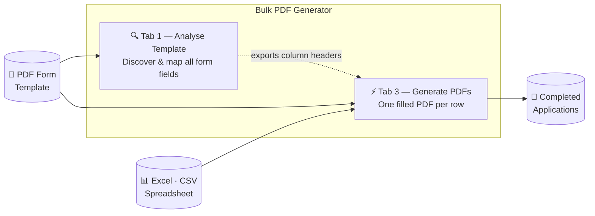

# Bulk PDF Generator

<div align="center">

**Batch-fill PDF forms from spreadsheet data — turning hours of manual data entry into a single click.**

[](https://github.com/mrdavearms/Bulk-PDF-generator-for-Vic-schools/releases/latest/download/Bulk%20PDF%20Generator.exe)

[](https://github.com/mrdavearms/Bulk-PDF-generator-for-Vic-schools/releases/latest)
[](LICENSE)
[](https://python.org)
[](https://github.com/mrdavearms/Bulk-PDF-generator-for-Vic-schools/releases)

</div>

---

Originally built to streamline VCAA Special Examination Arrangements Evidence Application forms, but works with **any** PDF form — TAFE enrolments, leave applications, compliance forms, consent forms, and more.

> [!NOTE]
> A Principal-developed app for educators and school leaders. Always review all generated outputs before use.

---

<div align="center">
  
</div>

---

## ✨ Features

| | |
|:---:|---|
| 📊 | **Batch processing** — generate hundreds of filled PDFs from a single spreadsheet |
| 🔍 | **Auto field detection** — scans any PDF and maps every form field automatically |
| ✏️ | **Combed field support** — handles character-by-character boxes without any manual setup |
| 👁️ | **Visual field preview** — click any field to see it highlighted on the PDF page |
| 📋 | **Multi-sheet Excel** — prompts you to pick the right sheet when a workbook has multiple tabs |
| 💾 | **One-click output** — all PDFs saved to a named folder; output opens automatically |
| 🖥️ | **No tech skills needed** — single `.exe` file, no Python or IT support required |

---

## How It Works



1. **Analyse** your blank PDF to discover every form field name
2. **Fill in** a spreadsheet — one row per person, column headers matching field names
3. **Generate** — the app fills and saves a complete, separate PDF for every row

---

## ⬇️ Quick Start

### Step 1 — Download

**No Python or technical setup required.**

### ➡️ [Download Bulk PDF Generator.exe](https://github.com/mrdavearms/Bulk-PDF-generator-for-Vic-schools/releases/latest/download/Bulk%20PDF%20Generator.exe)

Save the file somewhere convenient — your Desktop, a shared school drive, or a dedicated apps folder.

---

### Step 2 — Run the app

Double-click **`Bulk PDF Generator.exe`**.

<details>
<summary>⚠️ <strong>Windows Security Warning — what to do if you see it</strong></summary>

<br>

Because this app is not commercially code-signed (certificates cost hundreds of dollars per year), Windows Defender SmartScreen will flag it on first run. **The app is safe.** This is a known false positive for self-distributed software — the full source code is open for inspection.

**What you'll see:**

> *"Windows protected your PC"*
> *"Microsoft Defender SmartScreen prevented an unrecognised app from starting."*

**What to do:**

1. Click **"More info"** (the small link below the warning message)
2. A **"Run anyway"** button will appear at the bottom
3. Click **"Run anyway"**

You only need to do this **once**. Windows remembers your choice and the app opens normally from then on.

> [!TIP]
> **School IT environments:** If your managed security policy shows no "Run anyway" option, ask your IT administrator to whitelist the app or add an exclusion. The complete source code is at [github.com/mrdavearms/Bulk-PDF-generator-for-Vic-schools](https://github.com/mrdavearms/Bulk-PDF-generator-for-Vic-schools) for their review.

</details>

---

## 🎓 Try It With Sample Data

Not sure where to start? Download the sample files to see exactly how the app works before touching any real data — no setup required.

<div align="center">

### ⬇️ [Download All Sample Files — ZIP, 2 MB](https://github.com/mrdavearms/Bulk-PDF-generator-for-Vic-schools/releases/download/v2.1/Sample.Files.zip)

</div>

### 📂 What's included

| File | Download | Description |
|------|:--------:|-------------|
| `Evidence Application sample PDF from VCAA.pdf` | [⬇️](https://github.com/mrdavearms/Bulk-PDF-generator-for-Vic-schools/releases/download/v2.1/Evidence.Application.sample.PDF.from.VCAA.pdf) | **The blank PDF template** — this is the form the app fills in |
| `Evidence Application spreadsheet with data.xlsx` | [⬇️](https://github.com/mrdavearms/Bulk-PDF-generator-for-Vic-schools/releases/download/v2.1/Evidence.Application.spreadsheet.with.data.xlsx) | **Full data spreadsheet** — 3 fictional students; multi-sheet workbook that demonstrates the sheet-picker dialog |
| `sample data.xlsx` | [⬇️](https://github.com/mrdavearms/Bulk-PDF-generator-for-Vic-schools/releases/download/v2.1/sample.data.xlsx) | **Simple single-sheet version** — loads instantly, no sheet-picker dialog |
| `Duis_Ex_Evidence Application … 2026.pdf` | [⬇️](https://github.com/mrdavearms/Bulk-PDF-generator-for-Vic-schools/releases/download/v2.1/Duis_Ex_Evidence.Application.Wangaratta.High.School.2026.pdf) | **Sample output** — completed form for student 1 |
| `Minim_Elit_Evidence Application … 2026.pdf` | [⬇️](https://github.com/mrdavearms/Bulk-PDF-generator-for-Vic-schools/releases/download/v2.1/Minim_Elit_Evidence.Application.Wangaratta.High.School.2026.pdf) | **Sample output** — completed form for student 2 |
| `Sunt_Culpa_Evidence Application … 2026.pdf` | [⬇️](https://github.com/mrdavearms/Bulk-PDF-generator-for-Vic-schools/releases/download/v2.1/Sunt_Culpa_Evidence.Application.Wangaratta.High.School.2026.pdf) | **Sample output** — completed form for student 3 |

### How to run the sample

1. Download the ZIP above and unzip it, or grab the files individually from the table
2. Open the app and go to **Generate PDFs** (Tab 3)
3. Under **PDF Template**, browse to **`Evidence Application sample PDF from VCAA.pdf`**
4. Under **Excel / CSV Data File**, browse to **`Evidence Application spreadsheet with data.xlsx`**
5. Click **Load & Preview Data** — a sheet-picker dialog appears (this is a multi-sheet workbook). Select **Data** and click **Load this sheet**
6. Three student rows appear — click **Generate PDFs**
7. Your three completed PDFs land in a **`Completed Applications`** folder. Compare them with the three sample output PDFs to confirm everything is working correctly

> [!TIP]
> Want to skip the sheet-picker? Load **`sample data.xlsx`** instead — it's a single-sheet file that loads immediately without the dialog.

Once you're comfortable, you're ready to use it with your own PDF template and real data.

---

## 📖 How to Use

The app has five tabs:

### Getting Started (Tab 0)

An in-app guide covering how to prepare PDF templates — naming form fields, understanding combed fields, and setting up your spreadsheet. **Read this first** when working with a new template.

---

### 🔍 Analyse Template (Tab 1)

1. Click **Browse** and select your blank PDF form
2. Click **Analyse Fields** — every form field is listed with its name and type
3. Click any field in the list to see it **highlighted in red** on the PDF preview
4. Click **Export Mapping File** to download a ready-made Excel template with the correct column headers
5. Click **Save Template Config** to remember this template's setup for next time

---

### ⚡ Generate PDFs (Tab 3)

1. Select your PDF template and your filled-in Excel or CSV data file
2. Click **Load & Preview Data**

   > **Multi-sheet Excel files:** If your workbook has more than one sheet, a dialog will appear asking which sheet contains your data. This commonly occurs with files exported by the Analyse Template tab (which include a *Data*, *Field Mapping*, and *Instructions* sheet). Select your data sheet and click **Load this sheet**. If you cancel, nothing is loaded — just click **Load & Preview Data** again to retry.

3. You'll see a row for each person in your data — all rows are selected by default
4. Deselect any rows you want to skip
5. Click **Generate PDFs** — a progress bar tracks each file as it's created
6. When finished, your output folder opens automatically

---

### ℹ️ About (Tab 4)

Developer information and contact details.

---

## ✏️ What Are Combed Fields?

Government PDF forms often use individual character boxes for identifiers like student numbers:

```
┌───┬───┬───┬───┬───┬───┬───┬───┬───┬───┐
│ V │ C │ A │ A │ 1 │ 2 │ 3 │ 4 │ 5 │ 6 │
└───┴───┴───┴───┴───┴───┴───┴───┴───┴───┘
```

The app **automatically detects** these and splits your data character-by-character — just put the full value in your spreadsheet and it handles the rest.

---

## 📊 Spreadsheet Setup

Column headers must **match your PDF field names** (case-insensitive — `Surname`, `SURNAME`, and `surname` all work).

Two columns are required to name the output files:

- A column for the person's **surname**
- A column for their **first name**

All other columns are matched to PDF fields automatically. Unmatched columns are silently ignored.

**Supported formats:** `.xlsx` · `.xls` · `.csv`

### Multi-sheet Excel files

If your workbook contains more than one sheet, the app prompts you to choose which sheet holds your data before loading. This is especially common when using a file exported by the Analyse Template tab (which includes three sheets: *Data*, *Field Mapping*, and *Instructions*).

> [!TIP]
> To skip the prompt entirely, save your data as a single-sheet `.xlsx` or `.csv`. Single-sheet files always load immediately with no confirmation step.

---

## 📁 Output Files

Generated PDFs are saved to a **`Completed Applications`** folder next to your data file (or a custom folder you specify). Files are named:

```
FirstName_Surname_Evidence Application SchoolName Year.pdf
```

If a file with the same name already exists, the app adds `(1)`, `(2)`, etc. rather than overwriting.

---

## 🛠️ Troubleshooting

| Problem | Solution |
|---------|----------|
| Windows shows "Windows protected your PC" | Click **More info** → **Run anyway** — see the [warning guide](#step-2--run-the-app) above |
| IT security blocks the app with no "Run anyway" option | Ask your IT admin to whitelist it; share the [open source repo](https://github.com/mrdavearms/Bulk-PDF-generator-for-Vic-schools) for their review |
| A "Select Sheet" dialog appeared | Expected — your file has multiple sheets. Select the one with your data and click **Load this sheet** |
| Accidentally closed the sheet-picker dialog | Click **Load & Preview Data** again to re-open it |
| Fields not filling in output PDFs | Check that Excel column headers exactly match PDF field names (case-insensitive) |
| Visual preview not showing | Click **Analyse Fields** first in Tab 1 |
| Combed fields not splitting into separate boxes | Run **Analyse Fields** in Tab 1 before generating in Tab 3 |
| "Permission denied" error when loading Excel | Close the file in Excel before running the app |
| Text cut off in combed boxes | Expected — combed fields have a fixed character limit set by the PDF |

---

## 👨‍💻 For Developers — Running from Source

<details>
<summary>Expand setup and build instructions</summary>

### Requirements

- Python 3.10+
- `pip install -r requirements.txt`
- tkinter (included with standard Python on Windows; on macOS: `brew install python-tk@3.xx`)

### Setup

```bash
git clone https://github.com/mrdavearms/Bulk-PDF-generator-for-Vic-schools.git
cd Bulk-PDF-generator-for-Vic-schools
python -m venv venv

# Windows
.\venv\Scripts\activate

# macOS / Linux
source venv/bin/activate

pip install -r requirements.txt
python vcaa_pdf_generator_v2.py
```

### Building the Windows Executable

```bash
pip install pyinstaller
python -m PyInstaller BulkPDFGenerator.spec --clean
# Output: dist/Bulk PDF Generator.exe
```

Or double-click **`build_windows.bat`** for a guided, one-step build.

### Dependencies

| Package | Purpose |
|---------|---------|
| pypdf | PDF form filling |
| pandas | Excel / CSV data processing |
| openpyxl | Excel file creation |
| PyMuPDF (fitz) | PDF analysis, field extraction, page rendering |
| Pillow | Image processing for visual preview |
| tkinter | GUI framework (stdlib) |

### Project Structure

```
Bulk-PDF-generator-for-Vic-schools/
├── vcaa_pdf_generator_v2.py         # Main application
├── vcaa_models.py                   # Data models and persistence
├── vcaa_pdf_analyzer.py             # PDF field extraction engine
├── vcaa_visual_preview.py           # PDF page rendering + field highlighting
├── vcaa_combed_filler.py            # Character-by-character field filling
├── vcaa_theme.py                    # Theme system (colours, fonts, styles)
├── vcaa_markdown_renderer.py        # Markdown renderer for Getting Started tab
├── getting_started.md               # In-app guide content
├── icon.png / icon.ico              # Application icon
├── requirements.txt                 # Python dependencies
├── BulkPDFGenerator.spec            # PyInstaller build config
├── build_windows.bat                # Windows build script
├── Launch_BulkPDFGenerator.bat      # Windows launcher (from source)
├── Launch_BulkPDFGenerator.command  # macOS launcher (from source)
├── README.md                        # This file
└── ARCHITECTURE.md                  # Technical architecture documentation
```

See [ARCHITECTURE.md](ARCHITECTURE.md) for a full technical breakdown of every module, data flow, threading model, and design decisions.

</details>

---

## Developer

**Dave Armstrong**
A Principal-developed app for educators and school leaders.

📧 [Dave.Armstrong@education.vic.gov.au](mailto:Dave.Armstrong@education.vic.gov.au)
🐙 [github.com/mrdavearms/Bulk-PDF-generator-for-Vic-schools](https://github.com/mrdavearms/Bulk-PDF-generator-for-Vic-schools)

---

## Licence

MIT — see [LICENSE](LICENSE) for details.
